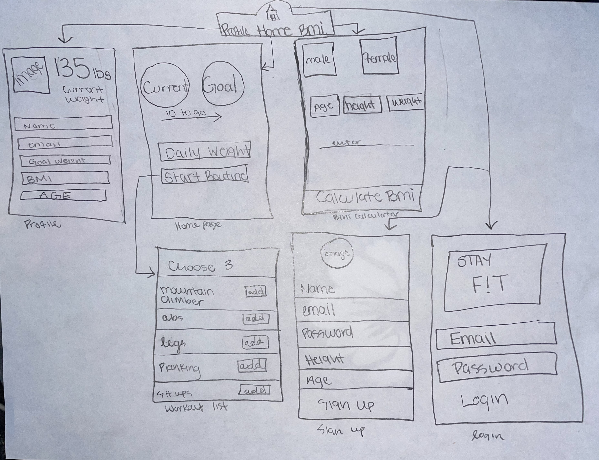
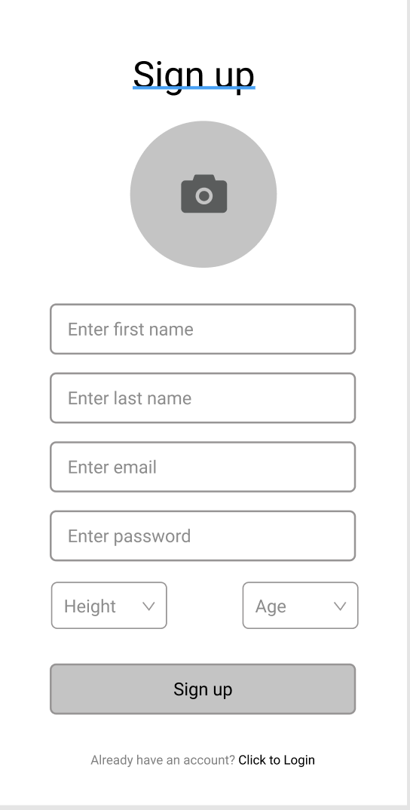
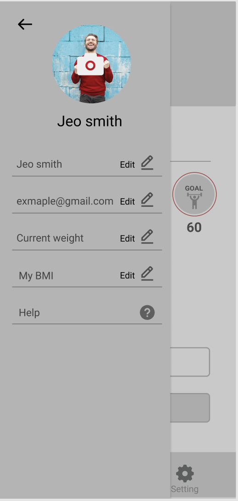
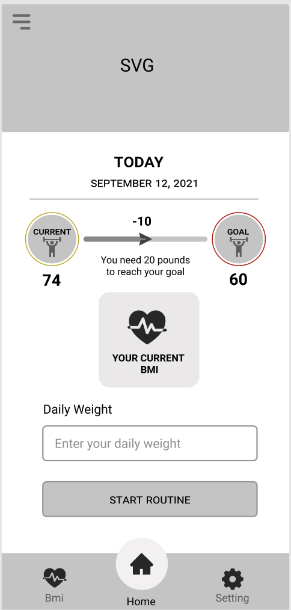
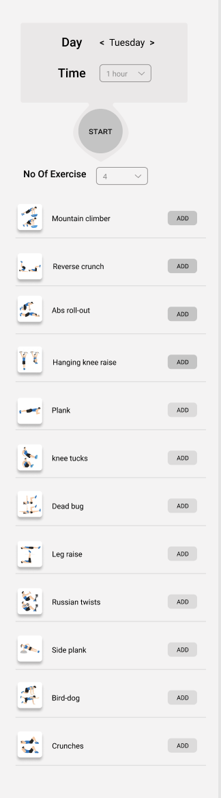
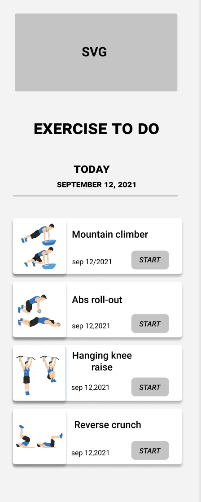
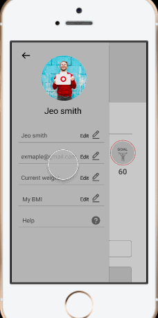
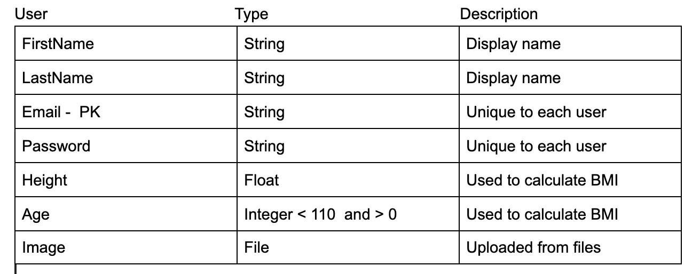

# StayFitApp
Unit 8: Group Milestone - README 
===

## Table of Contents
1. [Overview](#Overview)
1. [Product Spec](#Product-Spec)
1. [Wireframes](#Wireframes)

## Overview
### Description
Allows a user to record and track their current weight, and helps to suggest a workout plan for users to reach their desired weight goal.

### App Evaluation
- **Category:** FITNESS
- **Mobile:** This app would be primarily developed for mobile.
- **Story:** Helps track weight and progress, and provides a consistent daily workout plan 
- **Market:** Any individual could choose to use this app, The world is moving towards a more healthy lifestyle and people are more concerned about their physical health in regards to exercise. 
- **Habit:** Commonly will be used daily, but this app could be used as often or unoften as the user wanted depending on how committed they are to their workout routine.
- **Scope:** Men and women who want to start steady working out / watching their weight without the help of a trainer

## Product Spec
### 1. User Stories (Required and Optional)

**Required Must-have Stories**

* User logs in to create profile 
* User adds their current weight and weight goals
* User has the ability to select various wrokouts to add to a personal list

**Optional Nice-to-have Stories**

* Users weight goal is displayed with how far away from the goal the user is
* Congratulations displayed after completion of daily workout
* Profile Add-On: Upload a photo
* Optional Shuffle Button (i.e. random selection workout to be chosen for you)

### 2. Screen Archetypes

* Login 
* Register - User signs up or logs into their account
   * Upon Download/Reopening of the application, the user is prompted to log in to gain access to their profile information to be properly matched with another person. 
* Home Screen - Chat for users to communicate (direct 1-on-1)
   * default workout routine will be "Tuesdays and Thursdays are core/ab days" The workout for today will be 1 hour of core workouts.
*  Prompts the user to Choose 4 workouts to do 3 sets of 30.
	*  The workout list:
      Mountain climber.
      Reverse crunch.
      Dead bug.
      Leg raise.
      Abs roll-out.
      Bird-dog.
      Hanging knee raise.
      russian twists
      plank
      side plank
      knee tucks
      crunches etc...
*  User will choose 3 and add it to personal list for the day, upon completion user can add a check mark next to each item
 
* default workout routine will be "Monday, Wednesday and Friday are core/ab days" The workout for today will be 1 hour of Leg workouts.
*  Prompts the user to Choose 4 workouts to do 3 sets of 30.
	* The workout list: 
    Barbell Squats (High Bar)
    Front Squats.
    Walking Lunge.
    Bulgarian Split Squats.
    Deadlift (Barbell)
    Romanian Deadlift (Barbell)
    Seated Leg Press.
    Hip Thrust.
    Goblet Squat
    Glute Hamstring Curl etc...
* User will choose 3 and add it to personal list for the day, upon completion user can add a check mark next to each item
* After every item is checked off the list, the user is displayed a "Congratulations! You've finished your workout! See you tomorrow!"

* Profile Screen 
    * Allow a user to upload a picture
    * Prompts user to enter age, height, and demographic and stores on profile
    * Prompts user to enter their goal weight and current weight
    * Calculate their BMI and displays it
    * Displays "Current weight" - "Goal weight" - "Current BMI" and how many pounds needed to gain or lose to reach goal weight

* Settings Screen
   * Lets people change language, and app notification settings.

### 3. Navigation

**Tab Navigation** (Tab to Screen)

* Home
* Profile
* Settings

**Flow Navigation** (Screen to Screen)
* Forced Log-in -> Account creation if no log in is available
* Profile -> Text field to be modified. 
* Home -> Click to create your routine for the day
* Settings -> Toggle settings

## Wireframes
 

### [BONUS] Digital Wireframes & Mockups
      

### [BONUS] Interactive Prototype

### Schema
 

** Networking

List of networking requests by screen. 
* Profile Screen
	* (Read/GET) Query logged in user object
	* (Update/PUT) Update user profile image
